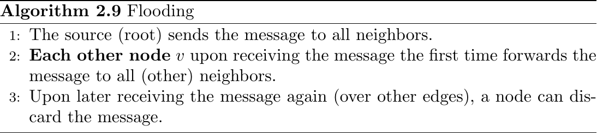
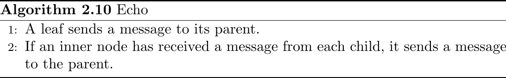
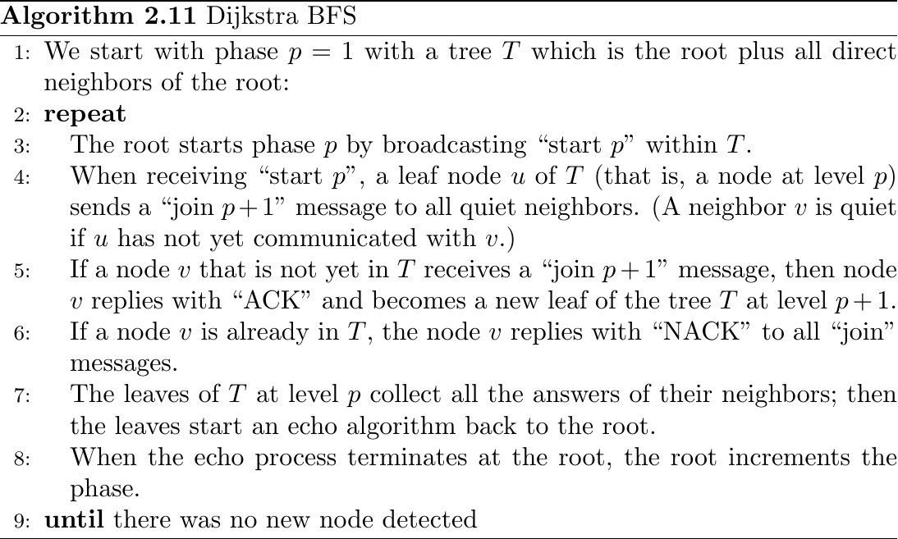
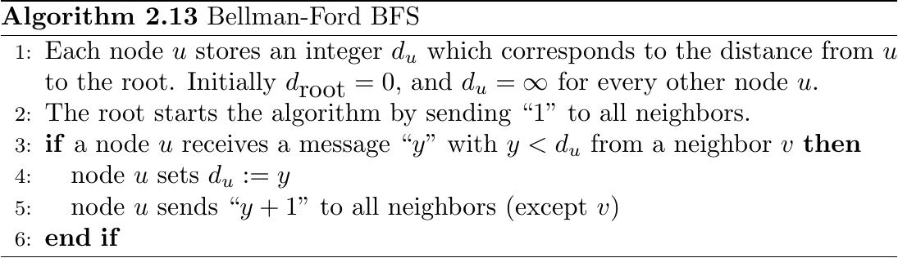
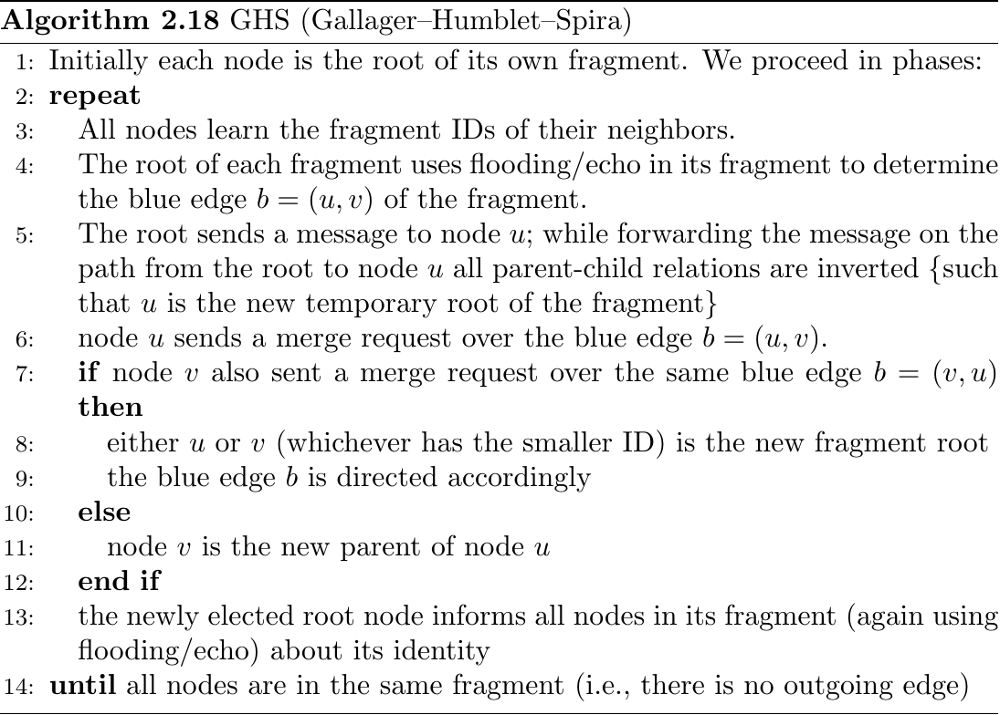

# Tree Algorithms \dotfill 15

## Broadcast \dotfill 15
Definition (Broadcast): Initiated by a single node (the source); source wants to send a message to all nodes.

Definition (Distance, Radius, Diameter): Distance between two nodes $u, v$ is defined as the number of minimum hops between them. Radius of node $u$ is maximum distance between $u$ and any other node; Radius of graph is minimum radius of any node in the graph. Diameter of graph is maximum distance between any two nodes.

Definition (Clean): Nodes don't know topology.

Theorem (Runtimes): $O(n)$ for broadcast, $O(m)$ (number of edges) for clean version (need to traverse all edges!).

Definition (Asynchronous): Event-driven with no global clock and messages sent arrive in finite but unbounded time.

### Flooding \dotfill 16
{ width=75% }

Message Complexity: $O(m)$ (whereby $m = \left|E\right|$).

Time Complexity: Radius of graph from source.

Note: Can be used to generate Spanning Tree $T$ (BFS style).

## Convergecast \dotfill 17
Reverse of Broadcast; All nodes (excluding source) send to source.

Note: Usually used as termination criterion.

### Echo \dotfill 17
{ width=75% }

Message Complexity: $O(n)$ ($n-1$ to be exact!). Paired with Flooding have $(O(m))$.

Time Complexity: Determined by depth of spanning tree (radius of root within tree).

## BFS Tree Construction \dotfill 18
Note: The following two algos are used asynchronously!

### Dijkstra \dotfill 18
{ width=75% }

Message Complexity: $O(m+nD)$ ($D$ is diameter of graph, $n$ number of nodes, $m$ number of edges).

Time Complexity: $O(D^2)$.

### Bellman-Ford \dotfill 19
{ width=75% }

Message Complexity: $O(nm)$.

Time Complexity: $O(D)$.

## MST Construction \dotfill 19
Note: Only used in weighted graphs (edges have weights $\omega_e$).

Definition: Given a weighted graph $G = (V, E, \omega)$, the MST of $G$ is a spanning tree $T$ minimizing $\omega(T)$, where $\omega(G') = \sum_{e \in G'} \omega_e$ for any subgraph $G' \subseteq G$.

Goal: Find the MST of $G$.

Assumption: No two edges share the same weight. Not essential but easier to work with.

Definition (Blue Edge): Let $T$ be a spanning tree of the weighted graph $G$ and $T' \subseteq T$ a subgraph of $T$ (also called a fragment). Edge $e = (u, v)$ is an outgoing edge of $T'$ if $u \in T'$ and $v \not \in T'$ (or vice versa). The minimum weight outgoing edge $b(T')$ is the so-called blue edge of $T'$.

Informally: The blue edge is the minimum edge going of $T'$ which will be added to the MST $T$ on the next round.

Note: This is basically a distributed version of Kruskal's sequential algorithm.

       KRUSKAL(G):
       1 A = $\emptyset$
       2 foreach v $\in$ G.V:
       3    MAKE-SET(v)
       4 foreach (u, v) in G.E ordered by weight(u, v), increasing:
       5    if FIND-SET(u) $\not =$ FIND-SET(v):
       6       A = A $\cup$ {(u, v)}
       7       UNION(u, v)
       8 return A

### Gallager-Humblet-Spira \dotfill 21
{ width=75% }

Message Complexity: $O(m \log(n))$.

Time Complexity: $O(n \log(n))$.
