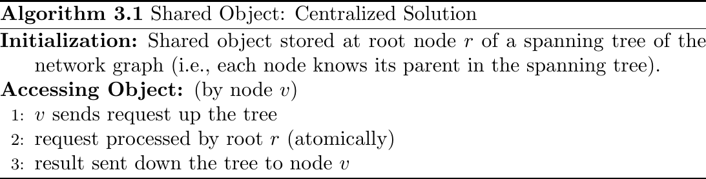
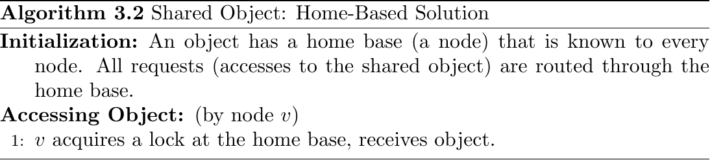
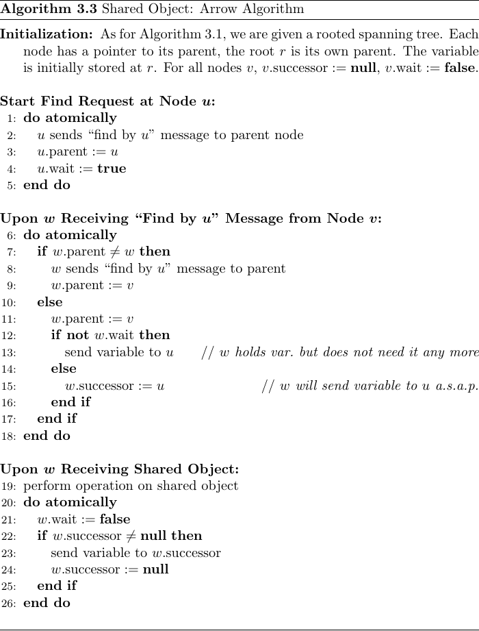
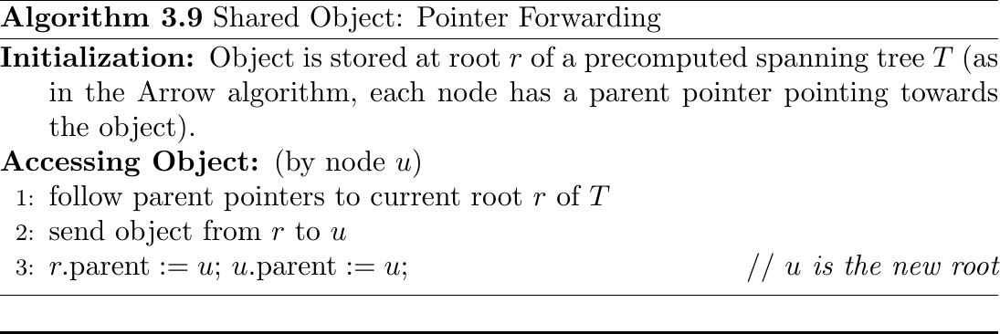
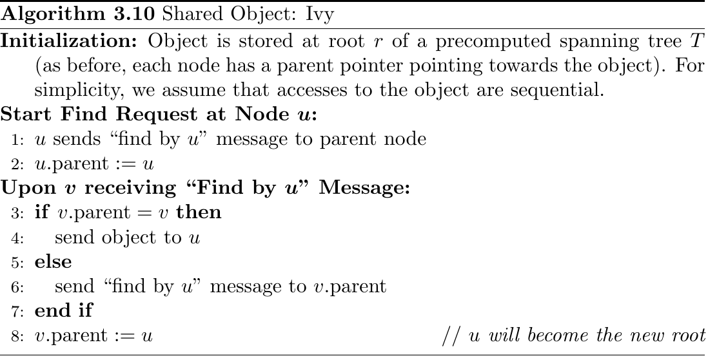

# Shared Objects \dotfill 23

## Centralized Solutions \dotfill 23
Idea: Store Object in a centralized location

### Centralized Solution \dotfill 23
{ width=75% }

Very inefficient. Doesn't use locality of requesters.

### Home-Based Solution \dotfill 24
{ width=75% }

Note: Suffers from Triangular Routing Problem!

## Arrow \& Friends \dotfill 24
Note: All arrows point in a quiescent moment (no find-op running) to the current owner of the object.

Note: Works in asynchronous and concurrent settings!

Message \& Time Complexity (find-op): $D$ messages ($D$ is diameter of spanning tree).

### Arrow Algorithm \dotfill 25
{ width=75% }

Message Complexity (find-op by $S$ nodes): $O(\log(\left|S\right|) m^*)$ where $m^*$ message complexity of optimal (with global knowledge) algorithm on the tree.

## Ivy \& Friends \dotfill 29
Note: These algorithms work on any complete graph $G$ (aka clique).

### Pointer Forwarding \dotfill 29
{ width=75% }

Note: Very good in cliques!

Note: Linear for linked-lists! So worst-case not good!

Important: Can violate wait-freeness!

### Ivy Algorithm \dotfill 29
{ width=75% }
