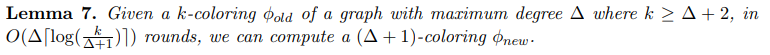
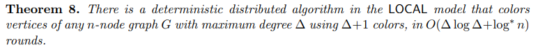
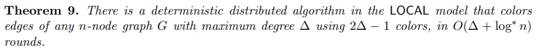

# Colouring General Graphs \dotfill 1
mlem

## Vertex Colouring \dotfill 1
mlem

### Linial's Colouring Algorithm \dotfill 1
Time complexity: $O(log^\*n)$
Coloring: $O(\Delta^2 log\Delta)$ colors

### $\Delta$-Cover Free Family \dotfill 1
Given a ground set ${1,2,\ldots,k'}$, a family of sets $S_1,S_2,\ldots,S_k \subseteq {1,2,\ldots,k'}$ is called a $\Delta$-cover free family if for each set of indices $i_0,i_1,i_2,\ldots,\i_{\Delta}$, we have $S_{i_0} \\ (\cup_{j=1}^{\Delta} S_{i_j})\neq \emptyset $. That is, if no set in the family is a subset of the union of $\Delta$ other sets.

### Kuhn-Wattenhofer Colouring Algorithm \dotfill 2
Time complexity: $O(\Delta\log\Delta+\log^\*n)$ rounds
Coloring: $\Delta +1$

#### One-by-One Reduction \dotfill 3
Single round reduction:
Given k-coloring where $k\geq\Delta+2$, in a single round, we can compute a $k-1$-coloring.

#### Parallelized \dotfill 3
{ width=75% }
{ width=75% }

## Edge Colouring \dotfill 3
{ width=75% }

### ??? LCL Problem? \dotfill 4
mlem
