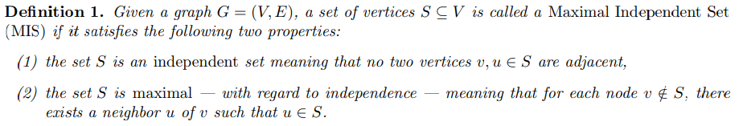

# Maximal Independent Set \dotfill 1
{ width=75% }

### Luby's Algorithm \dotfill 1
Computes MIS in $O(\log n)$ rounds, with high probability

The algo is made of iterations, each of which has two rounds:
- In the first round, each node picks a random real number and sends it to its neighbors. Then, the node joins the (eventual) MIS iff that node has a strict local maxima.
- In the second round, if a node joined the MIS, then it and its neighbors are all removed from the problem.
