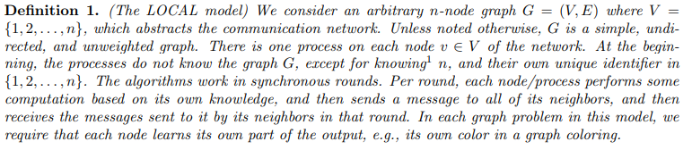
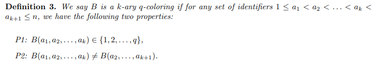

# Lower Bound for Colouring Trees \dotfill 1

## LOCAL Model \dotfill 1
{width=100%}

## Coloring Rooted Trees \dotfill 1
Any deterministic algorithm for 3-coloring $n$-node directed paths needs at least $\tfrac{\log^*(n)}{2}-2$ rounds.

### $k$-ary $q$-colorings \dotfill 1
{width=100%}

## Colouring Unrooted Trees \dotfill 3
Harder than coloring rooted trees because each node no longer knows its parent/children.
Rooted trees can be 3-colored in $O(\log^*(n))$ rounds (which is optimal).

### Lower Bound \dotfill 3
Any (deterministic) distributed algorithm A that colors $n$-node trees with maximum degree $\Delta$ using less than $o(\Delta / \log(\Delta))$ colors has round complexity at least $\Omega (\log_{\Delta}(n))$.

### Upper Bound \dotfill 4
There is a deterministic distributed algorithm that computes a 3-coloring of any $n$-node tree in $O(\log(n))$ rounds.
