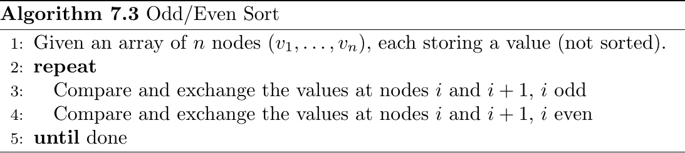
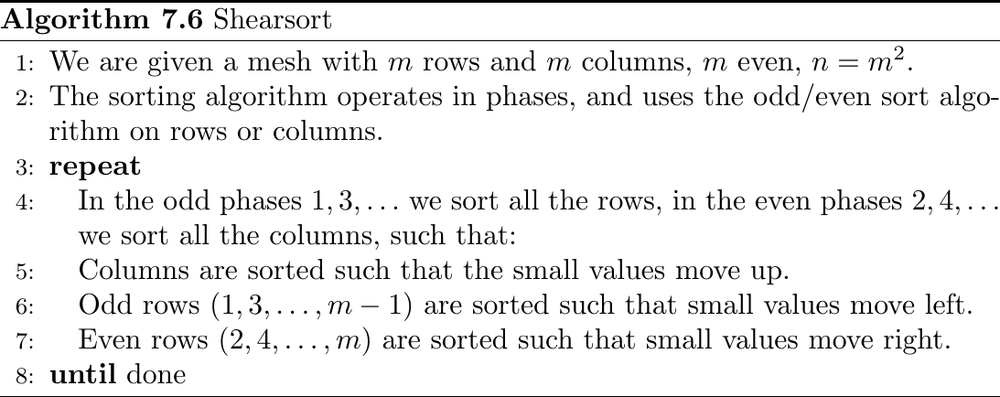
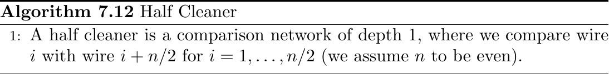
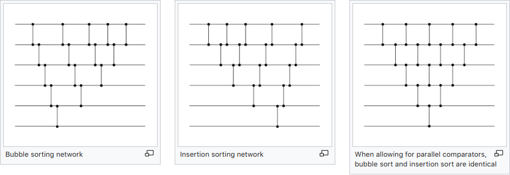
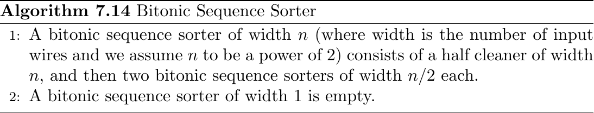
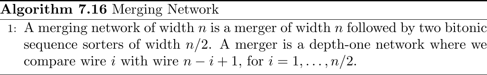
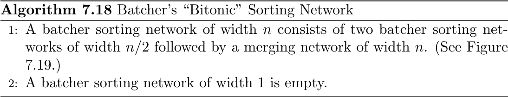
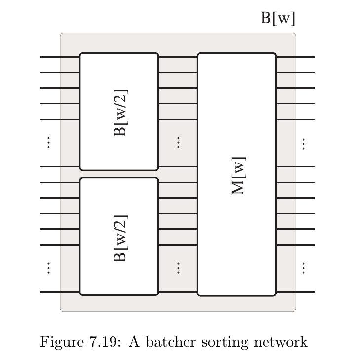
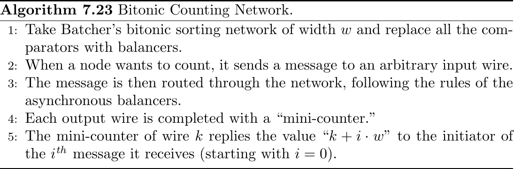
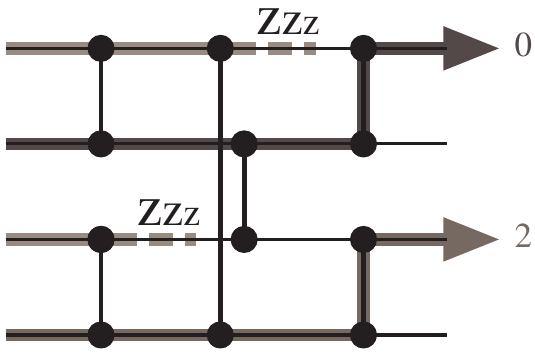

# Distributed Sorting \dotfill 25

Definition 7.1 (Sorting). We choose a graph with $n$ nodes $v_1, \dots, v_n$ . Initially each node stores a value. After applying a sorting algorithm, node $v_k$ stores the $k^{th}$ smallest value.

Definition 7.2 (Node Contention). In each step of a synchronous algorithm, each node can only send and receive $O(1)$ messages containing $O(1)$ values, no matter how many neighbours the node has.

## Array \& Mesh \dotfill 35
Lemma 7.4 (0-1 Sorting Lemma). If an oblivious comparison-exchange algorithm sorts all inputs of 0’s and 1’s, then it sorts arbitrary inputs.

### Odd/Even Sort \dotfill 36
{ width=75% }

Time Complexity: $O(n)$.

### Shearsort \dotfill 37
{ width=75% }

Time Complexity: $O(\sqrt{n}(\log(n+1)))$.

## Sorting Networks \dotfill 38
Definition 7.10 (Depth). The depth of an input wire is 0. The depth of a comparator is the maximum depth of its input wires plus one. The depth of an output wire of a comparator is the depth of the comparator. The depth of a comparison network is the maximum depth (of an output wire).

Note: Odd/Even networks with width $n$ have depth $n$.

Definition 7.11 (Bitonic Sequence). A bitonic sequence is a sequence of numbers that first monotonically increases, and then monotonically decreases, or vice versa.

Note: Generic bitonic sequences for us: $0^i1^j0^k$ or $1^i0^j1^k$ for $i, j, k \geq 0$.

General construction: Use the principle of insertion sort. Top wire get's smallest output, the one below second smallest, \dots. This can also be done with bubblesort as the basis.

### Half-Cleaner \dotfill 39
{ width=75% }

Lemma 7.13. Feeding a bitonic sequence into a half cleaner (Algorithm 7.12), the half cleaner cleans (makes all-0 or all-1) either the upper or the lower half of the $n$ wires. The other half is bitonic.

Lemma 7.15. A bitonic sequence sorter (Algorithm 7.14) of width $n$ sorts bitonic sequences. It has depth $\log(n)$.

{ width=85% }

### Bitonic Sequence Sorter \dotfill 40
{ width=75% }

### Merging Network \dotfill 40
{ width=75% }

Note: A merging network is a bitonic sequence sorter where the first half-cleaner is replaced by a merger.

### Batcher's Bitonic Sorting Network \dotfill 40
{ width=75% }

Theorem 7.20. A sorting network (Algorithm 7.18) sorts an arbitrary sequence of $n$ values. It has depth $O(\log^2(n))$.

{ width=50% }

## Counting Networks \dotfill 42
Theorem 7.30 (Counting vs. Sorting). If a network is a counting network then it is also a sorting network, but not vice versa.

Definition 7.21 (Distributed Counting). A distributed counter is a variable that is common to all processors in a system and that supports an atomic test-and-increment operation. The operation delivers the system’s counter value to the requesting processor and increments it.

Definition 7.22 (Balancer). A balancer is an asynchronous device which forwards messages that arrive on the left side to the wires on the right, the first to the upper, the second to the lower, the third to the upper, and so on.

### Bitonic Counting Network \dotfill 42
{ width=75% }

### Definition: Linearizable \& Linerizability \dotfill 45
Definition 7.31 (Linearizable). A system is linearizable if the order of the values assigned reflects the real-time order in which they were requested. More formally, if there is a pair of operations $o_1, $o_2$, where operation $o_1$ terminates before operation $o_2$ starts, and the logical order is “$o_2$ before $o_1$”, then a distributed system is not linearizable.

Lemma 7.32 (Linearizability). The bitonic counting network is not linearizable.

{ width=50% }
