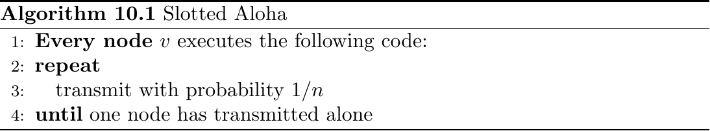
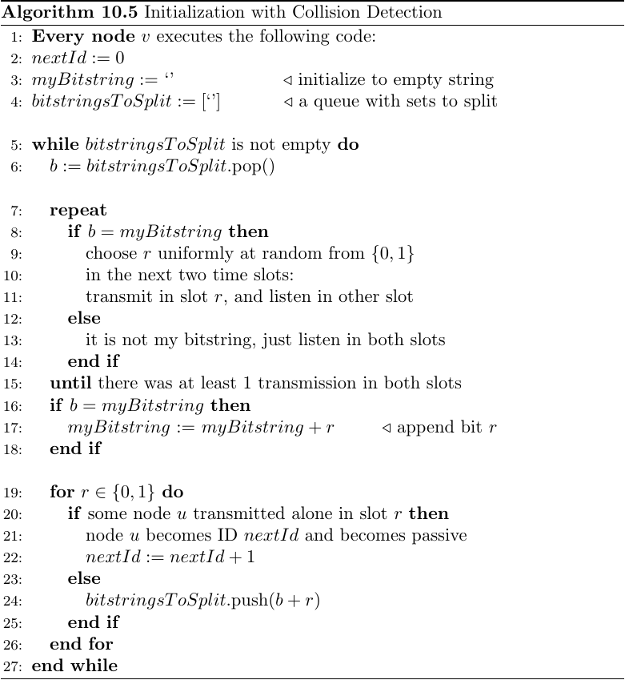
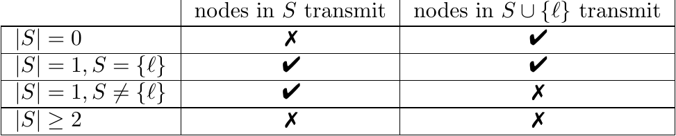
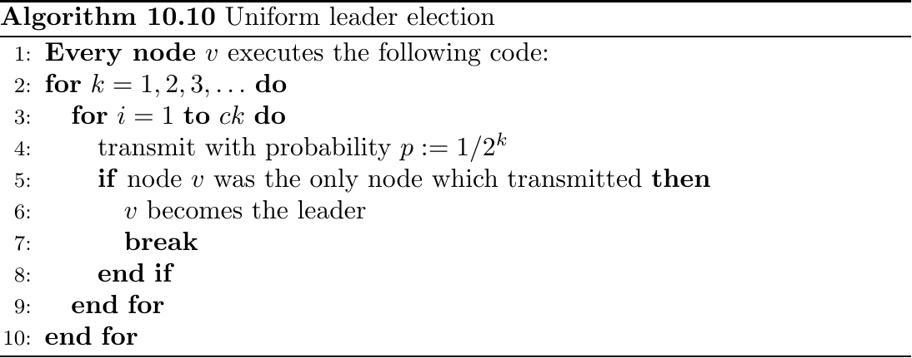
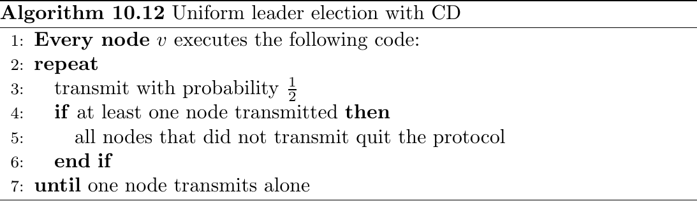
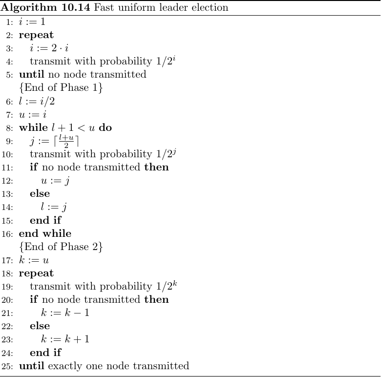

# Wireless Protocols \dotfill 48
mlem

## Basics \dotfill 48
mlem

### Slotted Aloha \dotfill 49
{ width=75% }

Theorem 10.2. Using Algorithm 10.1 allows one node to transmit alone (become a leader) after expected time $e$.

Note: Termination via distributed ACK, nodes continue Algorithm 10.1 including ID of leader.

## Initialization \dotfill 49
Goal: Give $n$ nodes IDs $\{1, 2, \dots, n \}$.

### Non-Uniform \dotfill 50
Theorem 10.3. If the nodes know $n$, we can initialize them in $O(n)$ time slots. Hint: Use Algorithm 10.1.

### Uniform with Collision Detection \dotfill 51
Definition 10.4 (Collision Detection, CD). Two or more nodes transmitting concurrently is called interference. In a system with collision detection, a receiver can distinguish interference from nobody transmitting. In a system without collision detection, a receiver cannot distinguish the two cases.

{ width=75% }

Time Complexity: $O(n)$.

Idea: Put nodes into sets (identified by bitstring) which themselves hold 2 more sets which are non-empty. Terminate once each node is alone within a set.

### Uniform without Collision Detection \dotfill 52
{ width=75% }

Note: $l$ is leader node!

Note: Algorithm 10.5 works without CD as well, factor 2 overhead.

Note: A leader immediately brings CD into a protocol.

## Leader Election \dotfill 52
Definition 10.8 (With High Probability). Some probabilistic event is said to occur with high probability (w.h.p.), if it happens with a probability $p \geq 1 − \tfrac{1}{nc}$ , where $c$ is a constant. The constant $c$ may be chosen arbitrarily, but it is considered constant with respect to Big-$O$ notation.

Theorem 10.9. Algorithm 10.1 elects a leader w.h.p. in $O(\log(n))$ time slots.

### Uniform Leader Election \dotfill 53
{ width=75% }

Time Complexity: $O(\log^2(n))$.

### Uniform Leader Election with Collision Detection \dotfill 54
{ width=75% }

Time Complexity: $O(\log(n))$.

### Fast Uniform Leader Election \dotfill 55
{ width=75% }

Time Complexity: $O(\log(\log(n)))$ for a probability of at least $1 - \tfrac{\log(\log(n))}{\log(n)}$.

Note: Leader election possible by bounds tightening with probability $1 - \tfrac{1}{\log(n)}$ in time $\log(\log(n)) + o(\log(\log(n)))$.

### Lower Bound \dotfill 57
Theorem 10.24. Any uniform protocol that elects a leader with probability of at least $1 - \tfrac{1}{2^t}$ must run for at least $t$ time slots.

### Uniform Asynchronous Wakeup without CD \dotfill 57
Theorem 10.25. If nodes wake up in an arbitrary (worst-case) way, any algorithm may take $\Omega(\tfrac{n}{\log(n))})$ time slots until a single node can successfully
transmit.
