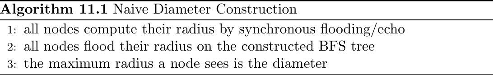
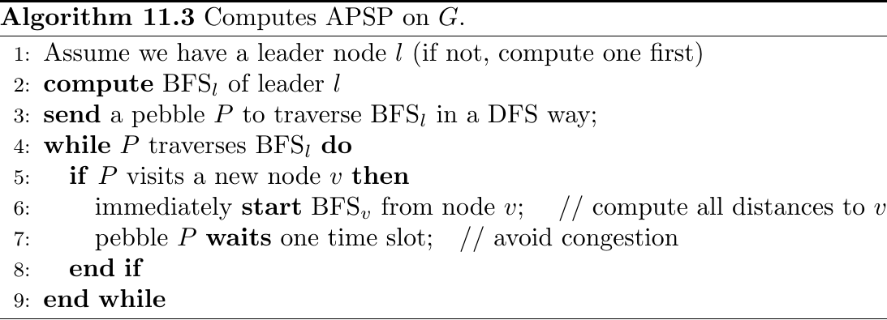
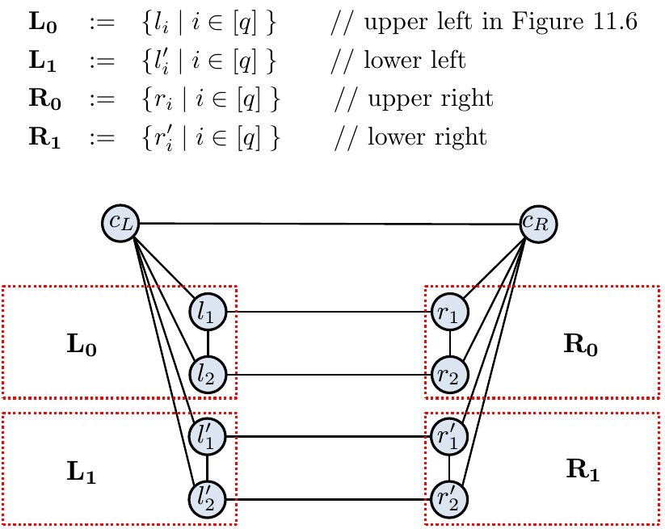
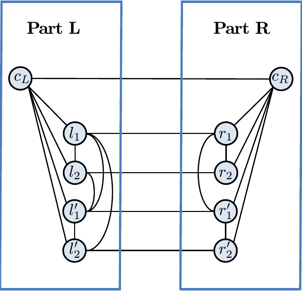
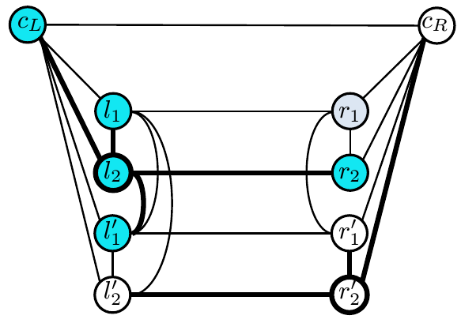
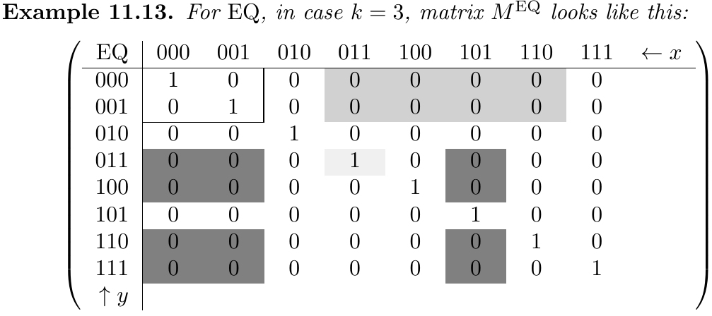
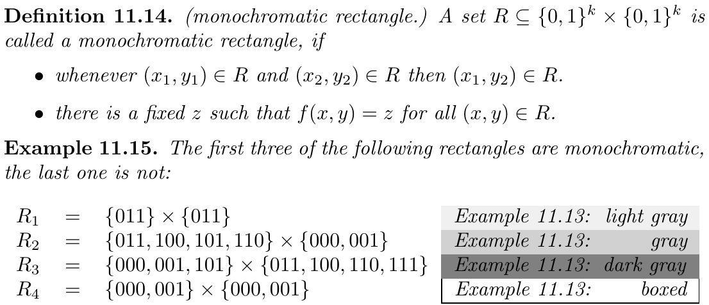
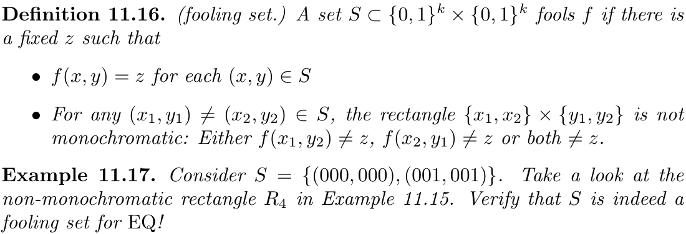
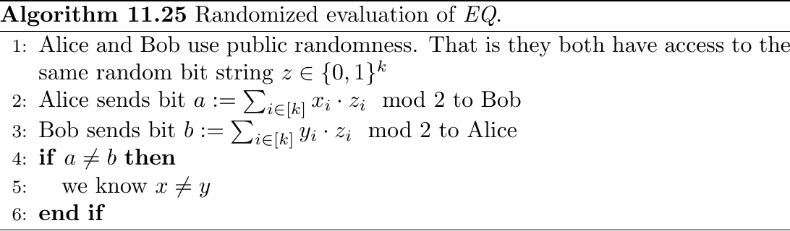

# Global Problems 1 \dotfill 61
Basically NP-alike problems which cannot be computed locally on the graph but require full knowledge of the topology.

## Diameter \& All Pairs Shortest Path \dotfill 61

Note: Computing network diameter takes $\Omega(\tfrac{n}{\log(n)})$ time.

### Naive Diameter Construction \dotfill 61
{ width=75% }

Time Complexity: $O(D)$ (asymptotically optimal).

Definition 11.2. ($BFS_v$) Performing a breadth first search at node $v$ produces spanning tree $BFS_v$ (see Chapter 2). This takes time $O(D)$ using small messages.

Note: Small messages are usually limited to size $O(\log(n))$.

### Compute APSP on G \dotfill 62
{ width=75% }

Time Complexity: $O(n)$ (Note, $D \leq n$)

## Lower Bound Graphs \dotfill 63
{ width=50% }

{ width=50% }

Lemma 11.8. The diameter of a graph $G = (V, E) \in \mathcal{G}$ is 2 if and only if: For each tuple $\left(i, j\right)$ with $i, j \in [q]$, there is either edge $(l_i, l_j')$ or edge $(r_i , r_j')$ (or both edges) in $E$.

{ width=50% }

Each part contains up to $q^2 \in \Theta(n^2)$ edges not belonging to the skeleton.

There are $2q + 1 \in \Theta(n)$ edges connecting the left and right part. As we transmit $O(\log(n))$ bits over each edge we have a bandwidth of $O(n\log(n))$ bits between both parts.

Transmitting information of $\Theta(n^2)$ edges naively requires with bandwidth $O(n\log(n))$ $\Omega(\tfrac{n}{\log(n)})$ time. This cannot be made quicker as no algorithm exists which can tell in less than $\Theta(n^2)$ bits the diameter.

## Communication Complexity \dotfill 66
Informally: In a more general setting, Alice and Bob are interested in computing a certain function $f: \{0, 1\}^k \times \{0, 1\}^k \implies \{0, 1\}$ with the least amount of communication between them. Of course they can always succeed by having Alice send her whole $k$-bit string to Bob, who then computes the function, but the idea here is to find clever ways of calculating $f$ with less than $k$ bits of communication.

Definition 11.11. (Communication complexity CC.) The communication complexity of protocol $A$ for function $f$ is $CC(A, f) := $minimum number of bits exchanged between Alice and Bob in the worst case when using $A$. The communication complexity of $f$ is $CC(f):= \min \{CC(A,f) | A \text{solves} f \}$. That is the minimal number of bits that the best protocol needs to send in the worst case.

{ width=75% }

{ width=75% }

{ width=75% }

Lemma 11.18. If $S$ is a fooling set for $f$, then $CC(f) = \Omega(\log(\left|S\right|))$.

Theorem 11.19. $CC(EQ) = \Omega(k)$.

Theorem 11.24. Any distributed algorithm $A$ that decides whether a graph $G$ has diameter 2 needs $\Omega(\tfrac{n}{\log(n)} + D)$ time.

### Randomized Evaluation of EQ \dotfill 70
{ width=75% }

Lemma 11.26. If $x \not = y$, Algorithm 11.25 discovers $x \not = y$ with probability at least $\tfrac{1}{2}$.

Note: Above algorithm works using shared randomness. It can be adapted to a private randomness version.

Note: Lower bound of $\Omega(\tfrac{n}{\log(n)})$ for any randomized distributed algorithm computing the diameter.

## Distributed Complexity Theory \dotfill 71
Strictly local problems can solved on $O(1)$.

Slightly slower are $O(\log^*(n))$ problems (combinatorial optimization problems in special graph cases, e.g. 3-colouring a ring\dots).

Pseudo-local problems require $O(\text{polylog}(n))$ time (e.g. maximal independent set).

Global problems require $O(D)$ time (e.g. count number of nodes in network).

Even more complex problems require polynomial $O(\text {poly}(n))$ time even under constant $D$ (e.g. diameter of network).
